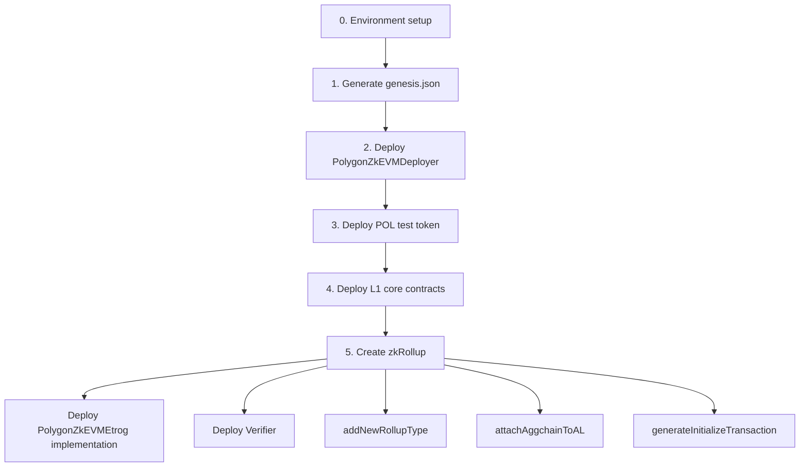

# Localhost Deployment Guide — PolygonZkEVMEtrog (zkRollup)

This guide walks through a **manual, step-by-step deployment** of the v2 AggLayer contracts on a local **Anvil** node, creating a classic **zkRollup** with `consensusContract: "PolygonZkEVMEtrog"`.

For parameter reference of individual JSON fields, see [README.md](./README.md).

---

## Overview

The v2 deployment is split into five stages:

| Step | Script | Network | Description |
|------|--------|---------|-------------|
| 1 | `1_createGenesis.ts` | Hardhat (in-memory) | Compute deterministic addresses and generate `genesis.json` |
| 2 | `2_deployPolygonZKEVMDeployer.ts` | localhost | Deploy the Create2 factory (`PolygonZkEVMDeployer`) |
| 3 | `prepareTestnet.ts` | localhost | Deploy POL test token and fund roles |
| 4 | `3_deployContracts.ts` | localhost | Deploy L1 core contracts |
| 5 | `4_createRollup.ts` | localhost | Register rollup type and create the zkRollup instance |



### zkRollup vs Aggchain

When using `PolygonZkEVMEtrog` with `isVanillaClient: false`, the deployment follows the **legacy zkRollup path**:

| Setting | zkRollup (`PolygonZkEVMEtrog`) | Aggchain (`AggchainFEP`) |
|---------|-------------------------------|--------------------------|
| `isVanillaClient` | `false` | `true` |
| `sovereignParams` | Not required | Required |
| `aggchainParams` | Not required | Required |
| `genesis.root` | Used from Step 1 | Not used |
| Verifier | `FflonkVerifier_{forkID}` or Mock | Not required |
| `programVKey` | Must be `bytes32(0)` | Aggchain-specific |

---

## Step 0 — Environment Setup

### Prerequisites

- Node.js (16+ recommended)
- npm
- [Foundry](https://book.getfoundry.sh/) (`anvil`)

From the project root:

```bash
npm i
npm run compile
cp .env.example .env
```

### `.env`

For local Anvil, the default Hardhat/Anvil mnemonic is sufficient:

```env
MNEMONIC="test test test test test test test test test test test junk"
INFURA_PROJECT_ID=""
ETHERSCAN_API_KEY=""
```

### Start Anvil

In a separate terminal (keep it running):

```bash
anvil --port 8545 --chain-id 31337
```

Hardhat's `localhost` network connects to `http://127.0.0.1:8545`.

### Anvil default accounts

These addresses match the Docker deployment templates:

| Account | Address | Role |
|---------|---------|------|
| #0 | `0xf39Fd6e51aad88F6F4ce6aB8827279cffFb92266` | Deployer / admin / timelock |
| #1 | `0x70997970C51812dc3A010C7d01b50e0d17dc79C8` | trustedAggregator |

### Clean up before a fresh deployment

```bash
rm -f .openzeppelin/localhost.json
rm -f deployment/v2/deploy_ongoing.json
```

> **Note:** You cannot deploy twice on the same network with the same `salt` and `initialZkEVMDeployerOwner`. Change at least one of them to redeploy.

---

## Step 1 — Configure `deploy_parameters.json`

```bash
cp docker/scripts/v2/deploy_parameters_docker.json deployment/v2/deploy_parameters.json
```

Example for local testing:

```json
{
    "test": true,
    "timelockAdminAddress": "0xf39Fd6e51aad88F6F4ce6aB8827279cffFb92266",
    "minDelayTimelock": 3600,
    "salt": "0x0000000000000000000000000000000000000000000000000000000000000000",
    "initialZkEVMDeployerOwner": "0xf39Fd6e51aad88F6F4ce6aB8827279cffFb92266",
    "admin": "0xf39Fd6e51aad88F6F4ce6aB8827279cffFb92266",
    "trustedAggregator": "0x70997970C51812dc3A010C7d01b50e0d17dc79C8",
    "trustedAggregatorTimeout": 604799,
    "pendingStateTimeout": 604799,
    "emergencyCouncilAddress": "0xf39Fd6e51aad88F6F4ce6aB8827279cffFb92266",
    "polTokenAddress": "",
    "realVerifier": false,
    "ppVKey": "0xac51a6a2e513d02e4f39ea51d4d133cec200b940805f1054eabbb6d6412c959f",
    "ppVKeySelector": "0x00000001",
    "zkEVMDeployerAddress": "",
    "deployerPvtKey": "",
    "maxFeePerGas": "",
    "maxPriorityFeePerGas": "",
    "multiplierGas": ""
}
```

Key fields:

- `test: true` — grants the deployer all RollupManager roles for local testing.
- `realVerifier: false` — uses a mock verifier for AggLayerGateway (recommended locally).
- `polTokenAddress: ""` — filled automatically in Step 3.

---

## Step 2 — Configure `create_rollup_parameters.json`

Use the fork-12 zkRollup template:

```bash
cp docker/scripts/v2/create_rollup_parameters_docker-fork12.json \
   deployment/v2/create_rollup_parameters.json
```

Example:

```json
{
    "realVerifier": false,
    "trustedSequencerURL": "http://zkevm-json-rpc:8123",
    "networkName": "zkevm",
    "description": "PolygonZkEVMEtrog consensus fork12",
    "trustedSequencer": "0xf39Fd6e51aad88F6F4ce6aB8827279cffFb92266",
    "chainID": 1004,
    "adminZkEVM": "0xf39Fd6e51aad88F6F4ce6aB8827279cffFb92266",
    "forkID": 12,
    "consensusContract": "PolygonZkEVMEtrog",
    "gasTokenAddress": "",
    "deployerPvtKey": "",
    "maxFeePerGas": "",
    "maxPriorityFeePerGas": "",
    "multiplierGas": "",
    "programVKey": "0x0000000000000000000000000000000000000000000000000000000000000000",
    "isVanillaClient": false
}
```

Key fields for zkRollup:

| Field | Value | Notes |
|-------|-------|-------|
| `consensusContract` | `"PolygonZkEVMEtrog"` | Classic zkEVM consensus |
| `isVanillaClient` | `false` | Standard L2 rollup (not sovereign) |
| `forkID` | `12` | Must match prover / zkROM version |
| `realVerifier` | `false` | Use `true` in production to deploy `FflonkVerifier_{forkID}` |
| `gasTokenAddress` | `""` | Native ETH as gas token |
| `programVKey` | `bytes32(0)` | Required for non-pessimistic consensus |
| `chainID` | `1004` | L2 chain ID (adjust as needed) |

Do **not** include `sovereignParams` or `aggchainParams` for this deployment path.

---

## Step 3 — Generate Genesis

Runs on the Hardhat in-memory network (does **not** connect to Anvil). Simulates deployments to compute deterministic contract addresses.

```bash
npx ts-node deployment/v2/1_createGenesis.ts --test
```

**Output:** `deployment/v2/genesis.json`

The `--test` flag uses the default test mnemonic, matching Anvil's funded accounts.

---

## Step 4 — Deploy PolygonZkEVMDeployer

Deploys the Create2 factory. Subsequent bridge addresses depend on this contract plus the `salt` in `deploy_parameters.json`.

```bash
npx hardhat run deployment/v2/2_deployPolygonZKEVMDeployer.ts --network localhost
```

**Output:**

- Console: `polygonZkEVMDeployer deployed on: 0x...`
- Updates `zkEVMDeployerAddress` in `deployment/v2/deploy_parameters.json`

> **Note:** This contract uses keyless deployment with a hardcoded gas price of **100 gwei** (see `deployment/helpers/deployment-helpers.ts`). Anvil accepts this by default.

---

## Step 5 — Deploy Test Tokens (POL)

Deploys the POL ERC20 mock and funds the sequencer and aggregator accounts.

```bash
npx hardhat run deployment/testnet/prepareTestnet.ts --network localhost
```

**Output:**

- Deploys `ERC20PermitMock` (POL)
- Transfers ETH and POL to sequencer / aggregator
- Updates `polTokenAddress` in `deploy_parameters.json`

When `gasTokenAddress` is `""`, no gas token is deployed (native ETH rollup).

---

## Step 6 — Deploy L1 Core Contracts

```bash
npx hardhat run deployment/v2/3_deployContracts.ts --network localhost
```

Contracts deployed:

| Contract | Purpose |
|----------|---------|
| ProxyAdmin | Proxy administration |
| PolygonZkEVMBridgeV2 | Cross-chain bridge (Create2 deterministic address) |
| PolygonZkEVMTimelock | Governance timelock |
| PolygonZkEVMGlobalExitRootV2 | Global exit root manager |
| Verifier (Mock) | Used when `realVerifier: false` |
| AggLayerGateway | AggLayer gateway |
| PolygonRollupManager | Rollup manager |

**Output:** `deployment/v2/deploy_output.json`

Also creates `.openzeppelin/localhost.json` (OpenZeppelin upgrade proxy manifest).

---

## Step 7 — Create the zkRollup

```bash
npx hardhat run deployment/v2/4_createRollup.ts --network localhost
```

**Required input files:**

- `deployment/v2/genesis.json`
- `deployment/v2/deploy_output.json`
- `deployment/v2/create_rollup_parameters.json`

**Internal flow (zkRollup path):**

1. Deploy `PolygonZkEVMEtrog` consensus implementation
2. Deploy verifier:
   - `realVerifier: false` → `VerifierRollupHelperMock`
   - `realVerifier: true` → `FflonkVerifier_{forkID}` (e.g. `FflonkVerifier_12`)
3. Call `addNewRollupType(...)` with `rollupVerifierType = 0` and `genesisFinal = genesis.root`
4. Call `attachAggchainToAL(...)` to instantiate the rollup
5. Call `generateInitializeTransaction(...)` to produce the first batch data

**Output:**

- `deployment/v2/create_rollup_output_<timestamp>.json`

Expected fields in the output:

```json
{
  "consensusContract": "PolygonZkEVMEtrog",
  "rollupAddress": "0x...",
  "verifierAddress": "0x...",
  "genesis": "0x...",
  "firstBatchData": { "..." : "..." },
  "rollupTypeId": "...",
  "rollupID": "..."
}
```

---

## Full Command Sequence

Run from the project root with Anvil active on port 8545:

```bash
# 0. Setup
npm run compile
cp docker/scripts/v2/deploy_parameters_docker.json deployment/v2/deploy_parameters.json
cp docker/scripts/v2/create_rollup_parameters_docker-fork12.json deployment/v2/create_rollup_parameters.json

# 1. Genesis
npx ts-node deployment/v2/1_createGenesis.ts --test

# 2. Deployer
npx hardhat run deployment/v2/2_deployPolygonZKEVMDeployer.ts --network localhost

# 3. POL token
npx hardhat run deployment/testnet/prepareTestnet.ts --network localhost

# 4. Core contracts
npx hardhat run deployment/v2/3_deployContracts.ts --network localhost

# 5. Create zkRollup
npx hardhat run deployment/v2/4_createRollup.ts --network localhost
```

### One-liner alternative

If configuration files are already in place:

```bash
npm run deploy:testnet:v2:localhost
```

> **Warning:** The npm script uses the default Docker rollup parameters (`AggchainFEP`). For `PolygonZkEVMEtrog`, copy the fork-12 template first (Step 2 above) before running the one-liner, or run the individual steps manually.

---

## Verify Deployment

```bash
cat deployment/v2/deploy_output.json
cat deployment/v2/create_rollup_output_*.json
```

Optional on-chain checks with Foundry:

```bash
cast block-number --rpc-url http://127.0.0.1:8545
cast balance 0xf39Fd6e51aad88F6F4ce6aB8827279cffFb92266 --rpc-url http://127.0.0.1:8545
```

---

## Production Considerations

1. Set `realVerifier: true` in `create_rollup_parameters.json` to deploy the real Fflonk verifier.
2. Ensure `forkID` matches your prover / zkROM version.
3. Ensure `genesis.root` matches the L2 genesis state.
4. Replace test addresses (`admin`, `trustedSequencer`, `trustedAggregator`) with multisig wallets.
5. Set `test: false` in `deploy_parameters.json` so the timelock retains control after deployment.

---

## Troubleshooting

| Error | Cause | Fix |
|-------|-------|-----|
| `There's upgradability information from previous deployments` | Stale OZ manifest | Delete `.openzeppelin/localhost.json` |
| `Missing parameter: polTokenAddress` | Step 5 not run | Run `prepareTestnet.ts` |
| `Missing parameter: zkEVMDeployerAddress` | Step 4 not run | Run `2_deployPolygonZKEVMDeployer.ts` |
| `Missing parameter: realVerifier` | Field not set in rollup params | Set `realVerifier` to `true` or `false` |
| `programVKey should be 0x for PolygonZkEVMEtrog` | Non-zero programVKey | Set to `bytes32(0)` |
| `Vanilla client only supports...` | Wrong client flag for Etrog | Set `isVanillaClient: false` |
| `Deployer does not have admin role` | `test: false` without proper roles | Set `test: true` for local dev |
| Cannot connect to localhost | Anvil not running | Start `anvil --port 8545` |
| Duplicate deployment failure | Same `salt` + owner reused | Change `salt` or `initialZkEVMDeployerOwner` |
